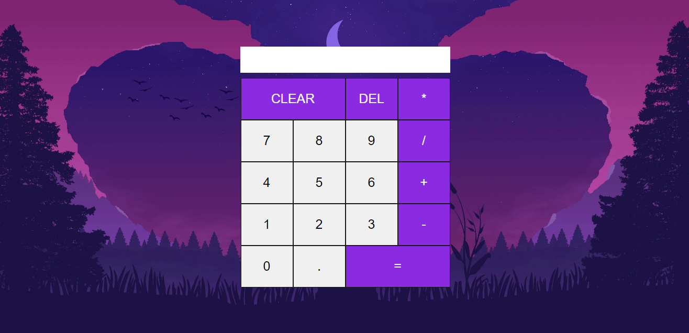

# Calculator-React
> desenvolvido por Carlos Eduardo

Este é um projeto de calculadora simples desenvolvido em ReactJS. O objetivo deste projeto é demonstrar a implementação de uma aplicação básica em ReactJS visando como o React facilita a vida na hora de desenvolver, esta calculadora contém funções básicas que realiza operações matemáticas como adição, subtração, mutiplicação, divisão e potenciação.

# Captura do projeto
 

# Tecnologias utilizadas

* ReactJS
* CSS

# Como executar o projeto

1. Clone este repositório em sua máquina local usando o comando:

```git
git clone https://github.com/Carlos-Eduardo5Qs/Calculator-React.git
```
2. Acesse o diretório raiz do projeto usando o comando:

```bash
cd Calculator-React
```
3. Instale as dependências do projeto usando o comando:

```bash
npm install
```
4. Inicie o servidor de desenvolvimento usando o comando:

```bash
npm run dev
```
5. No seu terminal onde o servidor foi iniciado, pressione a letra "o", assim o  vite iniciará o projeto no navegador padrão do seu sistema operacional e para ver todos os comando possíveis pressione "h" em seu terminal onde você iniciou o servidor.

# Como contribuir

* Faça um fork deste repositório.
* Crie uma nova branch com suas alterações: git checkout -b minha-branch
* Faça as alterações desejadas e adicione seus arquivos usando o comando git add .
* Faça o commit de suas alterações usando o comando git commit -m "minhas alterações"
* Faça o push para a branch criada anteriormente usando o comando git push origin minha-branch
* Crie um pull request para o repositório original.

# Problemas e sugestões
Se você encontrar algum problema ou tiver sugestões para melhorar este projeto, sinta-se à vontade para reportá-lo. Para isso, siga os passos abaixo:

1. Abra uma issue neste repositório;
2. Descreva o problema ou sugestão com o máximo de detalhes possível;
3. Aguarde uma resposta da equipe de desenvolvimento.
4. Sua ajuda é muito importante para a evolução deste projeto!
